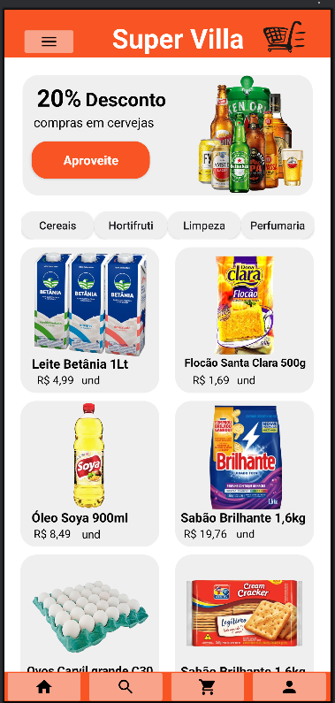
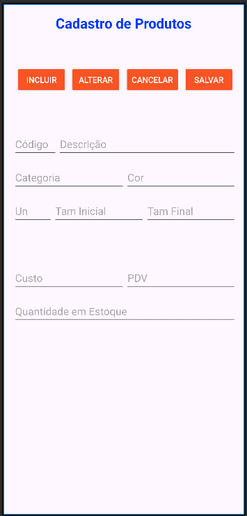

# 🛒 Super Villa - Aplicativo de Supermercado

Aplicativo mobile desenvolvido para o supermercado **Super Villa**, com o objetivo de oferecer aos clientes uma experiência prática e rápida na visualização de ofertas, produtos, categorias e novidades do mercado.




---

## 📱 Funcionalidades

- Visualização das principais **ofertas da semana**.
- Lista de **categorias** de produtos disponíveis.
- Destaque de **produtos em promoção**.
- Interface moderna e intuitiva, voltada para o usuário final.

---

## 🛠️ Tecnologias Utilizadas

- **Linguagem:** *(Ex: Dart com Flutter ou Java com Android Studio — ajuste conforme o projeto)*
- **Framework:** *(Ex: Flutter)*
- **Gerenciamento de estado:** *(Ex: Provider, Bloc — se aplicável)*
- **IDE:** *(Ex: Android Studio / VS Code)*
- **Outros:** *(Ex: Firebase, REST API — se houver)*

---

## ▶️ Como Rodar o Projeto

```bash
# Clone o repositório
git clone https://github.com/seu-usuario/super-villa-app.git

# Acesse a pasta do projeto
cd super-villa-app

# Instale as dependências
flutter pub get

# Execute o projeto (modo debug)
flutter run

---
## Autor
Este projeto foi desenvolvido por **Ari Junior**

- **LinkedIn:** https://www.linkedin.com/in/arijunior09/
- **GitHub:** https://github.com/AriJunior09
